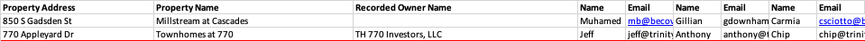

# Email Bot

This bot is a small web application intended to allow you to send emails based on a preconfigured template. 
The core functionality of the website has 3 pages:
- Homepage - Displays the signed in user and some basic stats
- Upload Page - Allows user to upload a spreadsheet and send emails for each row in the spreadsheet. (Specifics of format for spreadsheet to be discussed in depth below)
- Responses Page - Allows user to see whether or not they have received an email in response for each email they have sent out

## Template and Configurations

### Email Template
The email template is not currently configurable. To edit the template, you can go to template.py. The template for the email is currently defined as follows in template.py

```python
    template = (f"Hi {first_name},"
                f"Hope you’re doing well."
                f"It’s Eric Schwartz from BASE Realty Group."
                f"A client of mine came across your asset, {property_name}."
                f"They asked me to get in touch with you to see if you would entertain an offer on it."
                f"I'm happy to discuss further at your earliest convenience."
    )
```

### Upload Spreadsheet Format
The current format for an uploaded spreadsheet is as follows:



The order of the columns does NOT matter but the following columns are required
and if they are omitted will cause an error:
1. Property Name (row cannot be blank)
2. At least 1 column of "Name" (row cannot be blank)
3. At least 1 column of "Email" (row cannot be blank)
4. Property Address (you CAN leave the row blank but the column must exist)

